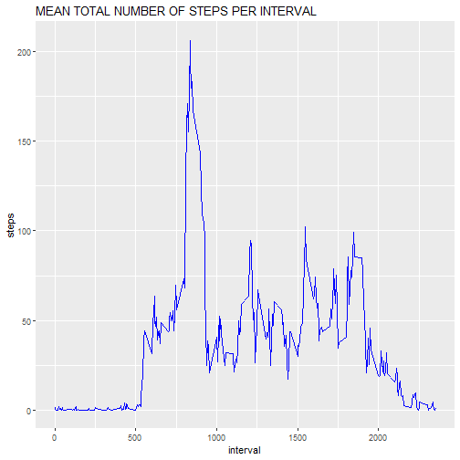
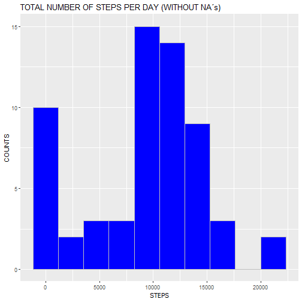
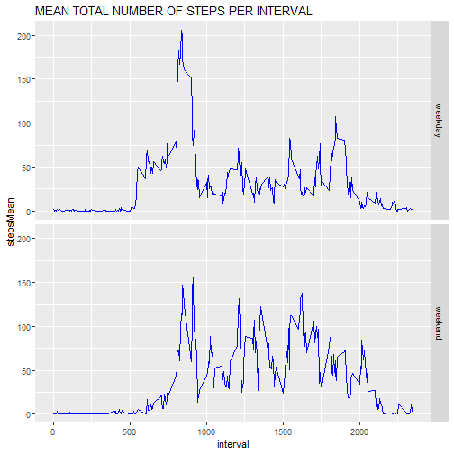

## Introduction

It is now possible to collect a large amount of data about personal movement using activity monitoring devices such as a Fitbit, Nike Fuelband, or Jawbone
Up. These type of devices are part of the "quantified self" movement - a group of enthusiasts who take measurements about themselves regularly to improve their
health, to find patterns in their behavior, or because they are tech geeks. But these data remain under-utilized both because the raw data are hard to obtain and there is a lack of statistical methods and software for processing and interpreting the data.

This assignment makes use of data from a personal activity monitoring device. This device collects data at 5 minute intervals through out the day. The data consists of two months of data from an anonymous individual collected during the months of October and November, 2012 and include the number of steps taken
in 5 minute intervals each day.

The data for this assignment can be downloaded from the course web site:

- Dataset: [Activity monitoring data](https://d396qusza40orc.cloudfront.net/repdata%2Fdata%2Factivity.zip) [52K]

The variables included in this dataset are:

- **steps**: Number of steps taking in a 5-minute interval (missing values are coded as \color{red}{\verb|NA|}NA)  
- **date**: The date on which the measurement was taken in YYYY-MM-DD format
- **interval**: Identifier for the 5-minute interval in which measurement was taken  

The dataset is stored in a comma-separated-value (CSV) file and there are a total of 17,568 observations in this dataset.  


## Loading and preprocessing the data

To start loading the libraries ** dplyr ** and ** ggplot2 **.
Afterwards, the data is read in the variable ** activity ** and a summary is generated.


```r
library(dplyr)
library(ggplot2)
activity <- read.csv("activity.csv")
summary(activity)
```

```
##      steps                date          interval     
##  Min.   :  0.00   2012-10-01:  288   Min.   :   0.0  
##  1st Qu.:  0.00   2012-10-02:  288   1st Qu.: 588.8  
##  Median :  0.00   2012-10-03:  288   Median :1177.5  
##  Mean   : 37.38   2012-10-04:  288   Mean   :1177.5  
##  3rd Qu.: 12.00   2012-10-05:  288   3rd Qu.:1766.2  
##  Max.   :806.00   2012-10-06:  288   Max.   :2355.0  
##  NA's   :2304     (Other)   :15840
```


Next the variables are adjusted to be able to use them later.


```r
activity$date <- as.Date(as.character(activity$date))
```


## What is mean total number of steps taken per day?

Then we will create a new object with the information of ** activity ** grouped according to ** date ** and the sum of ** steps **.


```r
activityday <- summarise(group_by(activity, date), stepsSum=sum(steps, na.rm = TRUE))
```

With the created object we make a histogram.


```r
qplot(stepsSum, data = activityday, main = "TOTAL NUMBER OF STEPS PER DAY", xlab = "STEPS", ylab = "COUNTS", bins = 10) + geom_histogram(colour = "gray", fill = "blue", bins = 10)
```


The mean and median of the total number of steps taken per day:


```r
actMeanMedian <- data.frame()
actMeanMedian[1,1] <- mean(activityday$stepsSum, na.rm = TRUE)
actMeanMedian[1,2] <- median(activityday$stepsSum, na.rm = TRUE)
names(actMeanMedian) <- c("Mean", "Median")
actMeanMedian
```

```
##      Mean Median
## 1 9354.23  10395
```


## What is the average daily activity pattern?

We are going to create a new object with the information of ** activity ** grouped according to ** interval ** and the average of ** steps **.
With this, a time series chart is made.


```r
activityInterval <- summarise(group_by(activity, interval),stepsMean = mean(steps, na.rm = TRUE))
names(activityInterval) <- c("interval", "steps")
qplot(interval, steps, data = activityInterval, geom = "path", main = "MEAN TOTAL NUMBER OF STEPS PER INTERVAL") + geom_path(colour = "blue")
```



The interval that contains the maximum number of steps:


```r
as.matrix(activityInterval[activityInterval$steps==max(activityInterval$steps, na.rm = TRUE),])
```

```
##      interval    steps
## [1,]      835 206.1698
```


## Imputing missing values

From the summary made at the beginning you can see that there are 2304 lost values in those associated with ** activity$steps **.

To complete the missing values we will use the median for that interval.


```r
activityNew <- activity
activityInterval <- summarise(group_by(activity, interval), steps = median(steps, na.rm = TRUE))
for (i in 1:dim(activity)[1]){
      if (is.na(activity[i,1])){
            activityNew[i,1] <- as.numeric(activityInterval[activityInterval$interval == activity[i, 3], 2])
      } 
}
activityDayNew <- summarise(group_by(activityNew, date), steps = sum(steps, na.rm = TRUE))
names(activityDayNew) <- c("interval", "steps")
qplot(steps,data = activityDayNew,main = "TOTAL NUMBER OF STEPS PER DAY (WITHOUT NA´s)", xlab = "STEPS", ylab = "COUNTS", bins = 10) + geom_histogram(colour = "gray",fill = "blue",bins = 10)
```



With the missing data modified we proceed to calculate the mean and median of the new data set.


```r
actMeanMedianMissing <- data.frame()
actMeanMedianMissing[1, 1] <- mean(activityDayNew$steps, na.rm = TRUE)
actMeanMedianMissing[1, 2] <- median(activityDayNew$steps, na.rm = TRUE)
names(actMeanMedianMissing) <- c("Mean", "Median")
actMeanMedianMissing
```

```
##       Mean Median
## 1 9503.869  10395
```

The error (%) compared to the data set with missing values is:


```r
Error <- round(-100*(actMeanMedianMissing[1,]-actMeanMedian[1,])/actMeanMedian[1,], digits = 3)
names(Error) <- c("MeanError", "MedianError")
Error
```

```
##   MeanError MedianError
## 1      -1.6           0
```


## Are there differences in activity patterns between weekdays and weekends?

Next, a new variable **activityNew$week** is generated, which indicates whether the date is a week day or a weekend.


```r
activityNew$day <- as.factor(weekdays(activityNew$date))
activityNew$day <- factor(activityNew$day, levels = levels(activityNew$day)[c(3, 4, 5, 2, 7, 6, 1)])
level <- levels(activityNew$day)
for (i in 1:5) {
      activityNew[activityNew$day == level[i], 5] <- "weekday"
}
for (i in 6:7) {
      activityNew[activityNew$day == level[i], 5] <- "weekend"
}
names(activityNew)[5] <- "week"
activityNew$week <- as.factor(activityNew$week)
summary(activityNew)
```

```
##      steps          date               interval             day      
##  Min.   :  0   Min.   :2012-10-01   Min.   :   0.0   lunes    :2592  
##  1st Qu.:  0   1st Qu.:2012-10-16   1st Qu.: 588.8   martes   :2592  
##  Median :  0   Median :2012-10-31   Median :1177.5   miércoles:2592  
##  Mean   : 33   Mean   :2012-10-31   Mean   :1177.5   jueves   :2592  
##  3rd Qu.:  8   3rd Qu.:2012-11-15   3rd Qu.:1766.2   viernes  :2592  
##  Max.   :806   Max.   :2012-11-30   Max.   :2355.0   sábado   :2304  
##                                                      domingo  :2304  
##       week      
##  weekday:12960  
##  weekend: 4608  
##                 
##                 
##                 
##                 
## 
```

With this, a grouping is made according to the variables **interval** and **week** considering the average of the steps, to subsequently create a graph showing steps vs. 5-second intervals for weekdays and weekends.


```r
activityNewWeekday <- summarise(group_by(activityNew, interval, week), stepsMean = mean(steps, na.rm = TRUE))
qplot(interval, stepsMean,data = activityNewWeekday, geom = "path", main = "MEAN TOTAL NUMBER OF STEPS PER INTERVAL") + facet_grid(week~.) + geom_path(colour = "blue")
```



